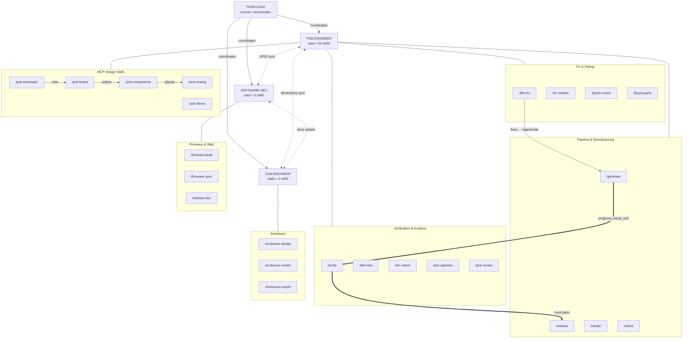

# ESP32 Emu Turbo

## Language

All code, comments, commit messages, documentation, and any written content in this project MUST be in **English**.

## Overview

Handheld retro gaming console based on ESP32-S3 with color TFT/LCD display (3.5"–4"), battery-powered with USB-C charging. SNES emulation (primary) and NES (secondary).

## Project Phases

1. **Feasibility analysis** — evaluate ESP32-S3 capabilities, select components, proof-of-concept software
2. **Hardware design** — KiCad schematics, OpenSCAD enclosure, GPIO mapping
3. **Hardware prototype** — assembly, testing and optimization
4. **Final version (v2)** — custom PCB + 3D-printed enclosure

## Hardware Requirements

- **MCU:** ESP32-S3 N16R8 (16MB flash, 8MB Octal PSRAM, dual-core LX7 240MHz)
- **Display:** ILI9488 3.95" 320x480, 8-bit 8080 parallel, bare panel 40P FPC 0.5mm
- **Power:** LiPo 3.7V 5000mAh (105080, 50x80x10mm)
- **Charging:** USB-C via IP5306 (charge-and-play)
- **Regulator:** AMS1117 5V->3.3V
- **Audio:** I2S DAC -> PAM8403 -> 28mm speaker
- **Storage:** Micro SD card via SPI (for ROMs)
- **Emulation targets:** SNES (primary), NES (secondary)
- **Controls:** 12 buttons (D-pad, A, B, X, Y, Start, Select, L, R) + optional PSP joystick
- **Prototype budget:** ~$33-45

## Project Structure

- `software/` — ESP-IDF v5.x firmware (Phase 1 hardware validation)
- `software/main/board_config.h` — GPIO pin definitions (source of truth for firmware)
- `hardware/kicad/` — KiCad 10 schematic project (full circuit design)
- `hardware/enclosure/` — OpenSCAD parametric 3D enclosure model
- `docker/` — Docker containers for headless rendering (KiCad + OpenSCAD)
- `scripts/` — Rendering and verification scripts
- `Makefile` — Top-level automation (`make render-all`, `make website-dev`)
- `docker-compose.yml` — Orchestrates rendering containers
- `website/` — Docusaurus site for GitHub Pages (https://pjcau.github.io/esp32-emu-turbo/)
- `website/docs/` — All documentation (single source of truth)

## Documentation

- `website/docs/feasibility.md` — feasibility analysis
- `website/docs/snes-hardware.md` — SNES hardware specification + GPIO mapping
- `website/docs/components.md` — BOM with AliExpress links
- `website/docs/schematics.md` — electrical schematic documentation
- `website/docs/prototyping.md` — breadboard wiring guide
- `website/docs/enclosure.md` — 3D enclosure design + renderings
- `website/docs/manufacturing.md` — JLCPCB PCBA ordering + cost analysis
- `website/docs/verification.md` — pre-production DRC/simulation/consistency checks
- `website/docs/software.md` — software architecture, SNES optimization, audio profiles

## Agents & Skills Architecture

### Agents (5)

```
team-lead (sonnet) ──── orchestrator, 0 skills
  ├── pcb-engineer (opus) ───── 20 skills
  ├── software-dev (opus) ───── 3 skills
  └── cad-engineer (haiku) ──── 3 skills

plan-reviewer (opus) ── pre-implementation plan review (PCB/routing/BOM changes)
scout (opus) ────────── /scout (GitHub pattern discovery, weekly via GitHub Action)
```

### Cross-Agent Dependencies

```
PCB ↔ SW:  config.py ↔ board_config.h  (GPIO pins sync)
PCB ↔ CAD: board.py 160×75mm ↔ enclosure.scad  (dimensions sync)
SW  ↔ CAD: website/docs/  (renders + documentation)
```

### Skills Map (29 total)

#### PCB-Engineer — 21 skills

| Category | Skills |
|----------|--------|
| **Pipeline (5)** | `/generate` (full PCB gen) · `/release` (JLCPCB package) · `/release-prep` (quick pipeline, no git) · `/render` (SVG + animation) · `/check` (DRC + 3D + gerbers) |
| **Verification (7)** | `/verify` (21 DFM tests) · `/dfm-test` (regression guards) · `/drc-native` (KiCad DRC + baseline) · `/pcb-optimize` (layout analysis) · `/pcb-review` (6-domain scored) · `/pad-analysis` (pad spacing check) · `/jlcpcb-alignment` (batch pin alignment) |
| **Fix & Debug (4)** | `/dfm-fix` (fix DFM issues) · `/fix-rotation` (CPL rotation) · `/jlcpcb-check` (3D alignment) · `/jlcpcb-parts` (BOM + LCSC search) |
| **MCP Design (5)** | `/pcb-schematic` (schematic ops) · `/pcb-components` (placement) · `/pcb-routing` (traces + vias) · `/pcb-library` (footprints) · `/pcb-board` (board setup) |

**Workflow pipeline:** `/pcb-schematic` → `/pcb-board` → `/pcb-components` → `/pcb-routing` → `/generate` → `/verify` → `/release`

#### Software-Dev — 3 skills

| Skill | Description |
|-------|-------------|
| `/firmware-build` | Build, flash, test ESP-IDF firmware via Docker |
| `/firmware-sync` | Verify GPIO pins match between firmware and schematic |
| `/website-dev` | Develop, build, deploy Docusaurus website |

#### CAD-Engineer — 3 skills

| Skill | Description |
|-------|-------------|
| `/enclosure-design` | OpenSCAD parametric enclosure design |
| `/enclosure-render` | Render enclosure views to PNG via Docker |
| `/enclosure-export` | Export STL files for 3D printing |

#### Scout — 1 skill (autonomous, weekly via GitHub Action)

| Skill | Description |
|-------|-------------|
| `/scout` | Search GitHub for new Claude Code patterns, evaluate, integrate, create PR |

### Architecture Diagram (Mermaid)



### Hooks (auto-guards)

| Trigger | Matcher | Action |
|---------|---------|--------|
| UserPromptSubmit | (all prompts) | Suggests relevant skills based on keyword matching |
| PreToolUse | `Bash`, `Edit`, `Write`, `Read` | Safety guard (prevents dangerous operations) |
| PreToolUse | `Edit`, `Write` | PCB edit guard (prevents direct .kicad_pcb edits) |
| PostToolUse | `Bash` (generate_pcb/release) | Reminds to run `verify_dfa.py` (DFA + SMT DFM) |
| PostToolUse | `Bash` (project scripts) | Enforces failure reporting before manual workarounds |
| PostToolUse | `Edit`, `Write` (PCB/PCBA files) | Reminds to run `verify_dfa.py` (DFA + SMT DFM) |
| Stop | (after response) | Auto-runs DFM verification if PCB files changed |

**MANDATORY**: After ANY change to PCB generator, footprints, routing, BOM, CPL, or JLCPCB export files, you MUST run `python3 scripts/verify_dfa.py` and confirm all 9 checks pass before committing.

Config: `.claude/settings.json` (hooks section)

### Makefile Quick Targets

| Target | Description |
|--------|-------------|
| `make fast-check` | Full pipeline with local kicad-cli (~5s) |
| `make verify-fast` | Quick DFM check only (43 tests, 1.4s) |
| `make verify-dfa` | Quick DFA check (9 assembly tests) |
| `make export-gerbers-fast` | Gerbers via local kicad-cli + Docker zone fill |
| `make release-prep` | Full pipeline: generate → gerbers → verify → render |
| `make firmware-sync-check` | Verify GPIO sync, fail on mismatch |
| `make verify-all` | Full verification suite (DFM + DFA + DRC + sim + consistency) |

### Performance Optimizations

**Container runtime: OrbStack** (replaces Docker Desktop)
- Drop-in replacement: same `docker` / `docker compose` commands, zero code changes
- Container startup: **0.2s** (was 3.2s with Docker Desktop) — **16x faster**
- Idle RAM: ~180 MB (was 2+ GB) — **11x less memory**
- Idle CPU: ~0.1% (was ~5%)

**Hybrid local+Docker pipeline** (`fast-check.sh`, `export-gerbers-fast.sh`)
- Local `kicad-cli` for DRC, gerber export, drill export (no container overhead)
- Docker only for zone fill (pcbnew Python API not available in kicad-cli)
- Full check pipeline: **~5s** (was ~15-20s with all-Docker)

| Operation | All-Docker (old) | Hybrid (new) | Speedup |
|-----------|-----------------|--------------|---------|
| Container startup | 3.2s | 0.2s | 16x |
| Gerber export (3 steps) | 4.7s | 4.0s | 1.2x |
| Full check pipeline | 15-20s | ~5s | 3-4x |
| DFM quick check | 1.4s | 1.4s | (no Docker) |

## Reference Software

- **Retro-Go** (github.com/ducalex/retro-go) — NES, GB, GBC, SMS
- **esp-box-emu** (github.com/esp-cpp/esp-box-emu) — NES, SNES, Genesis on ESP32-S3
