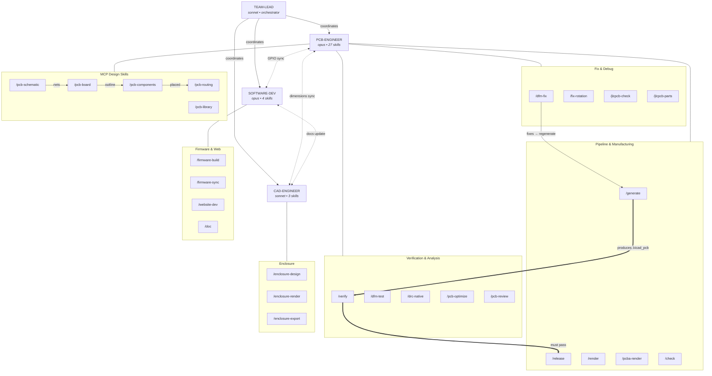

# Architecture — agents, skills, diagram

Moved out of CLAUDE.md so it is not loaded into every session. CLAUDE.md keeps the
one-paragraph summary and links here; the full skill list is injected automatically
into the system prompt, so this file is reference, not a lookup table.

### Skills Map

Counts are deliberately not written here — they drifted twice; the skill list
injected into the system prompt is authoritative.

#### PCB-Engineer

| Category | Skills |
|----------|--------|
| **Pipeline (7)** | `/generate` (full PCB gen) · `/release` (JLCPCB package) · `/release-prep` (quick pipeline, no git) · `/full-release` (all verifications + renders + JLCPCB package) · `/render` (SVG + animation) · `/pcba-render` (3D raytraced PCBA) · `/check` (DRC + 3D + gerbers) |
| **Verification** | `/first-article-check` (pre-payment JLC-preview + arrival photo inspection, per package family) · `/verify` (21 DFM tests) · `/dfm-test` (regression guards) · `/drc-native` (KiCad DRC + baseline) · `/drc-audit` (full electrical: shorts, unconnected, dangling vias) · `/pcb-optimize` (layout analysis) · `/pcb-review` (8-domain scored) · `/datasheet-verify` (pinout + physical vs datasheets) · `/design-intent` (18-test cross-source adversary) · `/pad-analysis` (pad spacing check) · `/jlcpcb-alignment` (batch pin alignment) · `/jlcpcb-validate` (JLCPCB manufacturing rules) |
| **Fix & Debug (4)** | `/dfm-fix` (fix DFM issues) · `/fix-rotation` (CPL rotation) · `/jlcpcb-check` (3D alignment) · `/jlcpcb-parts` (BOM + LCSC search) |
| **MCP Design (5)** | `/pcb-schematic` (schematic ops) · `/pcb-components` (placement) · `/pcb-routing` (traces + vias) · `/pcb-library` (footprints) · `/pcb-board` (board setup) |

**Workflow pipeline:** `/pcb-schematic` → `/pcb-board` → `/pcb-components` → `/pcb-routing` → `/generate` → `/verify` → `/release` (or `/full-release` for complete pipeline with renders)

#### Software-Dev — 4 skills

| Skill | Description |
|-------|-------------|
| `/firmware-build` | Build, flash, test ESP-IDF firmware via Docker |
| `/firmware-sync` | Verify GPIO pins match between firmware and schematic |
| `/website-dev` | Develop, build, deploy Docusaurus website |
| `/doc` | Audit docs against source-of-truth files, fix outdated values |

#### CAD-Engineer — 3 skills

| Skill | Description |
|-------|-------------|
| `/enclosure-design` | OpenSCAD parametric enclosure design |
| `/enclosure-render` | Render enclosure views to PNG via Docker |
| `/enclosure-export` | Export STL files for 3D printing |

#### Scout — 1 skill (autonomous, weekly via GitHub Action)

| Skill | Description |
|-------|-------------|
| `/scout` | Search GitHub for new Claude Code patterns, evaluate, integrate, create PR |

### Architecture Diagram (Mermaid)

