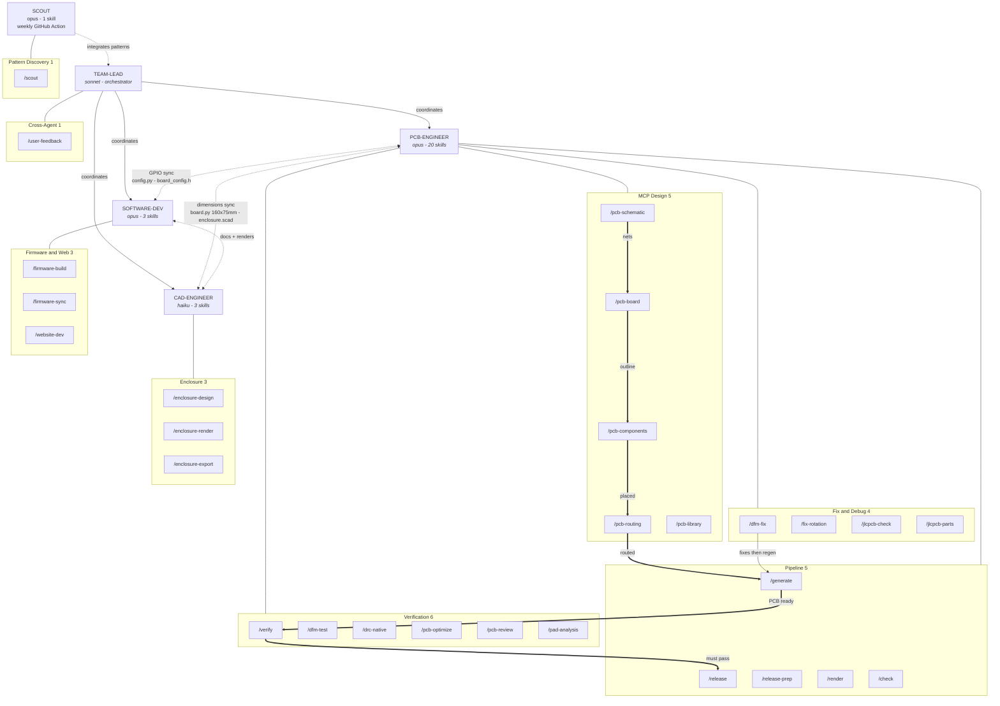

# Claude Code Agent Infrastructure

This project uses **Claude Code** as its AI-powered development assistant, with a multi-agent architecture that coordinates PCB design, firmware development, and CAD engineering.

## Architecture Overview

The system uses a **team-lead + 3 specialist agents** model:

```
team-lead (Sonnet) ──── orchestrator, task coordination
  ├── pcb-engineer (Opus) ───── 20 skills, PCB design + manufacturing
  ├── software-dev (Opus) ───── 3 skills, firmware + website
  └── cad-engineer (Haiku) ──── 3 skills, OpenSCAD enclosure

scout (Opus) ──── 1 skill, GitHub pattern discovery (weekly via GitHub Action)
```

### Architecture Graph



### Why This Structure?

- **Isolated contexts**: each agent has its own conversation context, preventing RAM bloat
- **Parallel execution**: independent tasks run simultaneously (e.g., PCB verify + render)
- **Right-sized models**: Haiku for repetitive CAD tasks (cheaper, faster), Opus for complex PCB/firmware reasoning
- **Skill-based dispatch**: 27 skills map to specific workflows, reducing prompt engineering overhead

### Why Opus for PCB and Software?

- **pcb-engineer**: routing with JLCPCB constraints (clearance, drill, annular ring) requires deep multi-step reasoning. DFM violations need root-cause analysis across multiple scripts. Errors cost real money (JLCPCB rework)
- **software-dev**: ESP-IDF firmware involves low-level GPIO, DMA, I2S, SPI debugging. Cross-domain sync (firmware ↔ schematic ↔ PCB) requires broad contextual understanding

## Skills System (28 Skills)

### PCB Engineer — 20 Skills

| Category | Skills | Description |
|----------|--------|-------------|
| **Pipeline (5)** | `/generate`, `/release`, `/release-prep`, `/render`, `/check` | Full PCB generation → JLCPCB export flow |
| **Verification (6)** | `/verify`, `/dfm-test`, `/drc-native`, `/pcb-optimize`, `/pcb-review`, `/pad-analysis` | 43 DFM + 9 DFA tests, DRC checks, layout scoring |
| **Fix & Debug (4)** | `/dfm-fix`, `/fix-rotation`, `/jlcpcb-check`, `/jlcpcb-parts` | Automated issue resolution |
| **MCP Design (5)** | `/pcb-schematic`, `/pcb-components`, `/pcb-routing`, `/pcb-library`, `/pcb-board` | Direct KiCad manipulation via MCP protocol |

**Standard workflow:** `/pcb-schematic` → `/pcb-board` → `/pcb-components` → `/pcb-routing` → `/generate` → `/verify` → `/release`

### Software Dev — 3 Skills

| Skill | Description |
|-------|-------------|
| `/firmware-build` | Build, flash, test ESP-IDF firmware via Docker |
| `/firmware-sync` | Verify GPIO pins match between firmware and schematic |
| `/website-dev` | Develop, build, deploy this Docusaurus website |

### CAD Engineer — 3 Skills

| Skill | Description |
|-------|-------------|
| `/enclosure-design` | OpenSCAD parametric enclosure design |
| `/enclosure-render` | Render enclosure views to PNG via Docker |
| `/enclosure-export` | Export STL files for 3D printing |

### Cross-Agent — 1 Skill

| Skill | Description |
|-------|-------------|
| `/user-feedback` | Record user preferences and distribute to agents/memory |

### Scout (Autonomous) — 1 Skill

| Skill | Description |
|-------|-------------|
| `/scout` | Search GitHub for new Claude Code patterns, evaluate relevance, integrate, create PR |

The scout agent runs **autonomously** via a weekly GitHub Action (Monday 02:00 UTC) or on-demand via `/scout`. It searches GitHub for new Claude Code skills, agents, hooks, and CLAUDE.md patterns, evaluates their relevance to this project, and creates PRs with useful integrations.

**State tracking**: `.claude/scout-state.json` persists seen repos and integrated patterns across runs.

## Cross-Agent Dependencies

```
PCB ↔ SW:   config.py ↔ board_config.h   (GPIO pins sync)
PCB ↔ CAD:  board.py 160×75mm ↔ enclosure.scad   (dimensions sync)
SW  ↔ CAD:  website/docs/   (renders + documentation)
```

The `/firmware-sync` skill verifies GPIO consistency between the schematic Python scripts and the C firmware header, preventing hardware/software mismatches.

## Performance Optimizations

### Token Optimization: RTK

[RTK (Rust Token Killer)](https://github.com/rtk-ai/rtk) is a token-optimized CLI proxy that reduces Claude Code token consumption by **60-90%** on dev operations. It works as a transparent hook-based rewriter — commands like `git status` are automatically routed through `rtk git status`, which filters and compresses output before it reaches the LLM context window.

Key features:
- **Zero-config**: hooks rewrite commands transparently, no workflow changes needed
- **Analytics**: `rtk gain` shows cumulative token savings across sessions
- **Discovery**: `rtk discover` analyzes Claude Code history for missed optimization opportunities
- **Rust-native**: minimal overhead, single binary

### Container Runtime: OrbStack

Replaced Docker Desktop with **OrbStack** for dramatically faster container operations:

| Metric | Docker Desktop | OrbStack | Improvement |
|--------|---------------|----------|-------------|
| Container startup | 3.2s | 0.2s | **16x faster** |
| Idle RAM | 2+ GB | ~180 MB | **11x less** |
| Idle CPU | ~5% | ~0.1% | **50x less** |

### Hybrid Local + Docker Pipeline

Instead of running everything inside Docker containers, critical operations use local `kicad-cli` while Docker handles only what requires the full KiCad Python API:

| Operation | All-Docker | Hybrid | Speedup |
|-----------|-----------|--------|---------|
| Full check pipeline | 15-20s | ~5s | **3-4x** |
| Gerber export | 4.7s | 4.0s | 1.2x |
| DFM quick check | N/A | 1.4s | Local only |

### PCB Parse Cache

The `.kicad_pcb` file (~750 KB) was parsed independently by 9 verification scripts using near-identical regex patterns. A centralized cache (`scripts/pcb_cache.py`) now parses once and stores results in `.pcb_cache.json`:

- **Parse once**: canonical parser extracts pads, vias, segments, zones, nets, refs
- **SHA-256 invalidation**: cache auto-rebuilds when `.kicad_pcb` changes
- **Auto-build**: cache is rebuilt automatically after every `make generate-pcb`
- **Lazy loading**: consumers call `load_cache()` (~8ms) instead of parsing (~120ms)

| Metric | Before | After | Improvement |
|--------|--------|-------|-------------|
| Single script parse | ~120ms | ~8ms load | **93% faster** |
| 9 scripts total parse | ~1000ms | ~190ms (1 parse + 9 loads) | **81% less** |
| `make verify-all` | ~3.0s | 0.11s | **27x faster** |

### Parallel Execution

Build and verification targets run in parallel where possible:

- **`verify-all`**: 6 Python verification scripts run simultaneously (DFM + DFA + DRC + sim + consistency + short-circuit)
- **`render-all`**: schematics, enclosure, and PCB renders run in parallel (~8s vs ~20s)
- **Docker cached builds**: skip rebuild when images are unchanged (0s vs 15-20s)

### Session Management

Claude Code conversation history can grow to gigabytes over time. Our management strategy:

| Strategy | Impact |
|----------|--------|
| Max session length: 1-2 hours | Prevents context window bloat |
| Weekly session archive (>7 days) | Reduced from 1.4 GB to ~100 MB |
| Subagent delegation | Isolates heavy work from main context |
| Max 3 concurrent subagents | Prevents API contention |

## Automated Guards (Hooks)

Hooks run automatically to prevent workflow errors (committed in `.claude/settings.json`):

| Trigger | Condition | Action |
|---------|-----------|--------|
| After `Bash` | Command contains `generate_pcb` | Reminds to run DFM verification |
| After `Edit` | File path in `scripts/generate_pcb/` | Reminds to regenerate PCB |
| After `Edit` | PCB/PCBA file modified | Reminds to run DFA verification |
| After `Write` | PCB/PCBA file modified | Reminds to run DFA verification |
| **Pre-commit** | PCB files staged | Runs `make verify-fast` (blocks commit on failure) |

These prevent common mistakes: editing PCB generation scripts without regenerating and re-verifying.

## Anti-Stall Protocol

Rules that prevent agents from getting stuck in loops:

1. **Max 3 failed attempts** per approach — then change strategy
2. **Max 4 steps per agent task** — split larger tasks into sub-tasks
3. **Verify after each fix** — regenerate + analyze after every change
4. **User feedback every 2-3 minutes** during long tasks
5. **Kill stalled agents after 5 minutes** — relaunch with narrower scope
6. **Analytical over heuristic** — always parse actual files, never guess

## Makefile Quick Reference

| Target | Time | Description |
|--------|------|-------------|
| `make verify-fast` | ~1.5s | Quick DFM check (43 tests) |
| `make verify-dfa` | ~1.1s | Quick DFA check (9 assembly tests) |
| `make verify-all` | ~1.6s | All verification checks (DFM + DFA + DRC + sim + consistency) |
| `make fast-check` | ~5s | Full pipeline (local kicad-cli) |
| `make render-all` | ~8s | Full render pipeline (parallel) |
| `make release-prep` | ~15s | Generate → gerbers → verify → render |
| `make firmware-sync-check` | under 1s | GPIO sync verification |
