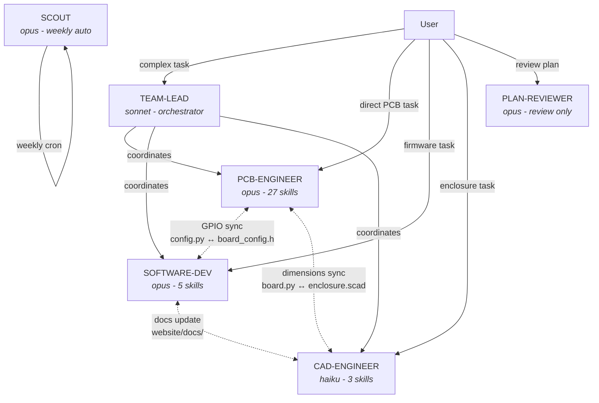
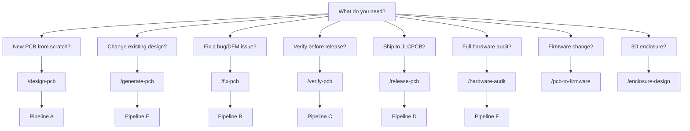

# Agent & Skill Workflow Guide

How to use the 6 agents, 43 skills, and 6 lifecycle commands to design, verify, fix, and release the ESP32 Emu Turbo PCB.

---

## Architecture Overview



---

## When to Use What

### Decision Tree



---

## Scenario 1 — New PCB from Scratch

```
/bootstrap-new-pcb              scaffold project structure
        |
        v
/design-pcb                     composes 4 skills:
   |-- /pcb-schematic           define GPIO_NETS, regenerate .kicad_sch
   |-- /pcb-board               set outline, layers, mounting holes
   |-- /pcb-components          place footprints in board.py
   '-- /pcb-routing             route traces + vias in routing.py
        |
        v
/generate-pcb                   composes 2 skills:
   |-- /generate                Python -> .kicad_pcb + BOM + CPL
   '-- /check                   DRC + 3D + gerbers + DFM
        |
        v
/verify-pcb                     composes 8 verification skills
        |
        v
    [failures?] --yes--> /fix-pcb --> /generate-pcb (loop)
        |
        no
        v
/pcb-to-firmware                sync board_config.h
        |
        v
/release-pcb                    gerbers + renders + git tag
```

### When to invoke the team-lead agent

Use `/team-lead` (or just describe a complex task) when changes span **multiple domains**:
- "Add a new audio amplifier" → team-lead dispatches pcb-engineer (footprint + routing) + software-dev (I2S driver) + cad-engineer (speaker cutout)
- "Change the display from SPI to parallel" → all three agents need updates

---

## Scenario 2 — Fix a DFM Issue

After JLCPCB DFM report or `verify_dfm_v2.py` failure:

```
JLCPCB DFM report (PDF)
    or
/verify  -->  failures found
        |
        v
/dfm-fix <report>              read report, categorize, fix source files
        |                      (board.py / routing.py / footprints.py)
        |
        +-- /fix-rotation      if CPL rotation wrong
        +-- /jlcpcb-check      if 3D alignment wrong
        +-- /jlcpcb-parts      if BOM parts out of stock
        |
        v
/generate                      regenerate .kicad_pcb
        |
        v
/verify                        confirm all 115 DFM tests pass
        |
        v
/dfm-test                      add regression guard test
        |
        v
    [still failing?] --yes--> repeat /dfm-fix
        |
        no
        v
/release-prep                  sync release_jlcpcb/ (no git commit)
```

### Key: the fix cycle


---

## Scenario 3 — Pre-Release Verification

Full verification sweep before ordering from JLCPCB:

```
/verify-pcb                composes ALL verification skills:
    |
    |-- /verify            115 DFM + 9 DFA + 26 JLCPCB
    |-- /drc-native        KiCad native DRC + baseline delta
    |-- /drc-audit         full electrical classification
    |-- /pad-analysis      pad spacing table
    |-- /jlcpcb-validate   26 JLCPCB manufacturing rules
    |-- /datasheet-verify  246 pin-to-net checks vs datasheets
    |-- /design-intent     362 cross-source consistency checks
    '-- /pcb-review        8-domain 100-point scored review
```

### Hard gates (must pass for release)

| Gate | Script | What it catches |
|---|---|---|
| Fab shorts | `verify_trace_through_pad.py` | Trace over unnetted pad |
| Trace crossings | `verify_trace_crossings.py` | Same-layer different-net overlap |
| Copper clearance | `verify_copper_clearance.py` | < 0.10mm copper gap (Shapely) |
| Net connectivity | `verify_net_connectivity.py` | Fragmented copper per net |

---

## Scenario 4 — Release to JLCPCB

```
/release-pcb               composes /full-release:
    |
    |-- 1. /generate       regenerate from Python
    |-- 2. /verify         115 DFM + 9 DFA + 26 JLCPCB
    |-- 3. /drc-native     KiCad DRC
    |-- 4. /render         SVG layers + animation
    |-- 5. /pcba-render    11 raytraced 3D PCBA views
    |-- 6. Export gerbers  kicad-cli + Docker zone fill
    |-- 7. BOM + CPL       JLCPCB formatting
    |-- 8. Sync            release_jlcpcb/ updated
    '-- 9. Commit + tag    git commit + version tag + push
```

After release:
1. Upload `release_jlcpcb/gerbers.zip` to [jlcpcb.com](https://jlcpcb.com/)
2. Upload `bom.csv` + `cpl.csv` for SMT assembly
3. Verify 3D viewer alignment for bottom-side components
4. Order 5x PCBs, 4-layer, 1.6mm, ENIG, SMT both sides

---

## Scenario 5 — Hardware Audit (Deep Review)

```
/hardware-audit
    |
    |-- Layer 1: Automated gates (22 scripts, 1200+ checks)
    |   HARD BLOCK if ANY fail - fix before Layer 2
    |
    |   verify_trace_through_pad   (fab shorts)
    |   verify_trace_crossings     (same-layer crossings)
    |   verify_copper_clearance    (Shapely polygon gaps)
    |   verify_net_connectivity    (per-net copper graph)
    |   verify_dfm_v2             (115 DFM tests)
    |   verify_dfa                (9 assembly tests)
    |   validate_jlcpcb           (26 JLCPCB rules)
    |   verify_polarity           (47 pin-to-net)
    |   verify_datasheet_nets     (261 checks)
    |   verify_datasheet          (29 physical)
    |   verify_design_intent      (362 cross-source)
    |   verify_schematic_pcb_sync (R4 guard)
    |   verify_strapping_pins     (12 ESP32 boot)
    |   verify_decoupling_adequacy (25 cap checks)
    |   verify_power_sequence     (26 power chain)
    |   verify_power_paths        (8+11 copper paths)
    |   erc_check + KiCad DRC     (0 real shorts)
    |   ... and more
    |
    '-- Layer 2: Domain-by-domain prose review (8 domains)
        |
        |-- Step 1: Power chain (USB-C -> IP5306 -> AMS1117 -> ESP32)
        |-- Step 2: ESP32 boot (strapping pins, PSRAM mode)
        |-- Step 3: Display (ILI9488 8080 parallel, FPC)
        |-- Step 4: Audio (I2S PDM -> PAM8403 -> speaker)
        |-- Step 5: SD card (SPI 1-bit, TF-01A)
        |-- Step 6: Buttons (12 + menu combo D1 + power switch)
        |-- Step 7: USB (native FS, CC pull-downs, ESD TVS)
        '-- Step 8: Emulator performance (PSRAM, DMA, LCD)

    Output: hardware-audit-bugs.md with CRIT/HIGH/MED/LOW findings
```

---

## Scenario 6 — GPIO / Component Change

When you change a GPIO assignment or add/remove a component:

```
1. Edit scripts/generate_schematics/config.py    (master GPIO map)
        |
        v
2. /pcb-to-firmware                               auto-sync:
   |-- board_config.h updated
   |-- datasheet_specs.py updated
   |-- routing.py button assignments updated
   '-- website/docs/ updated
        |
        v
3. /generate-pcb                                  regen PCB + quick verify
        |
        v
4. /verify-pcb                                    full sweep
        |
        v
5. /firmware-sync                                 confirm GPIO match
```

---

## Scenario 7 — Enclosure Update

After PCB board outline or component position changes:

```
1. /enclosure-design       update OpenSCAD parameters
        |                  (pcb_w, pcb_h, cutouts, screw holes)
        v
2. /enclosure-render       7 PNG views via Docker
        |
        v
3. /enclosure-export       STL files for 3D printing
```

---

## Quick Reference — Skill Categories

### Design Phase (create from scratch)

| Skill | What it does |
|---|---|
| `/pcb-schematic` | Define GPIO nets, generate .kicad_sch sheets |
| `/pcb-board` | Set board outline, layers, mounting holes |
| `/pcb-components` | Place all component footprints |
| `/pcb-routing` | Route traces, vias, copper zones |
| `/pcb-library` | Query footprint pad info |

### Generate Phase (build artifacts)

| Skill | What it does |
|---|---|
| `/generate` | Python scripts -> .kicad_pcb + BOM + CPL + gerbers |
| `/check` | DRC + 3D render + gerbers + DFM quick check |
| `/render` | SVG layer views + animation GIF |
| `/pcba-render` | 11 photorealistic 3D PCBA views (raytracer) |

### Verify Phase (find problems)

| Skill | What it does |
|---|---|
| `/verify` | 115 DFM + 9 DFA + 26 JLCPCB + connectivity |
| `/drc-native` | KiCad DRC with smart filtering + baseline delta |
| `/drc-audit` | Full electrical classification (shorts, unconnected, dangling) |
| `/pcb-review` | 8-domain 100-point scored review |
| `/datasheet-verify` | 246 pin-to-net checks vs component datasheets |
| `/design-intent` | 362 cross-source adversary (GPIO, power, signal chains) |
| `/pad-analysis` | Pad spacing distance table |
| `/jlcpcb-alignment` | IC/connector rotation + position vs CPL |
| `/jlcpcb-validate` | 26 JLCPCB-specific manufacturing rules |
| `/dfm-test` | DFM regression guard test generator |
| `/pcb-optimize` | 5-module 100-point layout optimization score |

### Fix Phase (resolve issues)

| Skill | What it does |
|---|---|
| `/dfm-fix` | Fix DFM violations from report + add guard test |
| `/fix-rotation` | Fix CPL rotation for JLCPCB assembly |
| `/jlcpcb-check` | Check 3D alignment for a specific component |
| `/jlcpcb-parts` | Check BOM stock + find alternative LCSC parts |

### Release Phase (ship to fab)

| Skill | What it does |
|---|---|
| `/release-prep` | Quick: generate + verify + gerbers + sync release_jlcpcb/ |
| `/release` | Manual: prepare release without auto-commit |
| `/full-release` | Complete: all verify + renders + gerbers + commit + tag |

### Audit Phase (deep review)

| Skill | What it does |
|---|---|
| `/hardware-audit` | Layer 1 (22 automated gates) + Layer 2 (8-domain prose) |
| `/electrical-review` | Strapping + decoupling + power sequence + SPICE |

### Firmware / Docs

| Skill | What it does |
|---|---|
| `/pcb-to-firmware` | Propagate PCB changes to board_config.h + docs |
| `/firmware-build` | Build/flash ESP-IDF firmware via Docker |
| `/firmware-sync` | Verify GPIO match between config.py and board_config.h |
| `/hardware-test-gen` | Generate ESP-IDF Unity test firmware for prototype |
| `/doc` | Audit docs vs source-of-truth, fix outdated values |
| `/website-dev` | Build/deploy Docusaurus site |

### CAD

| Skill | What it does |
|---|---|
| `/enclosure-design` | OpenSCAD parametric enclosure design |
| `/enclosure-render` | Render 7 PNG views via Docker |
| `/enclosure-export` | Export STL for 3D printing |

---

## Lifecycle Commands (composed workflows)

| Command | Composes | Use when |
|---|---|---|
| `/design-pcb` | schematic -> board -> components -> routing | New PCB or major redesign |
| `/generate-pcb` | generate -> check | After any design change |
| `/verify-pcb` | verify -> drc -> audit -> pad -> jlcpcb -> datasheet -> intent -> review | Before release |
| `/fix-pcb` | dfm-fix -> fix-rotation -> jlcpcb-check -> jlcpcb-parts | After verify failures |
| `/release-pcb` | full-release (verify + render + gerbers + commit) | Ship to JLCPCB |
| `/bootstrap-new-pcb` | scaffold new project | Starting fresh |

---

## Source of Truth Hierarchy

```
 config.py          <-- MASTER: GPIO assignments
     |
     v
 board_config.h     <-- firmware (must match config.py)
     |
     v
 datasheet_specs.py <-- pin-to-net specs (34 components)
     |
     v
 routing.py         <-- PCB traces + vias
     |
     v
 .kicad_pcb         <-- GENERATED (never edit directly!)
 .kicad_sch         <-- GENERATED (never edit directly!)
```

**Rule**: changes flow DOWN this hierarchy. Never edit `.kicad_pcb` directly. Never let `board_config.h` drive `config.py`. Use `/pcb-to-firmware` to propagate changes downward.

---

## Hooks (Auto-Triggers)

These run automatically — no manual invocation needed:

| When | What happens |
|---|---|
| Every prompt | Skill suggestions based on keywords |
| Before any Edit/Write | Blocks direct .kicad_pcb edits |
| After `generate_pcb` or `release` | Reminds to run `verify_dfa.py` |
| After any PCB file edit | Reminds to run DFA verification |
| Before context compaction | Saves session backup |
| After Claude stops responding | Auto-runs DFM if PCB files changed |

---

## Agent Coordination Examples

### Example 1: "Add battery voltage monitoring"

```
User -> team-lead:
  "Add battery voltage ADC reading to the design"

team-lead dispatches:
  1. pcb-engineer: add R divider on BAT+ → GPIO (ADC2 channel)
     -> /pcb-schematic (add R divider to power sheet)
     -> /pcb-components (place 2x 0805 resistors)
     -> /pcb-routing (route divider to ESP32 ADC pin)
     -> /generate + /verify

  2. software-dev: add ADC reading to firmware
     -> /pcb-to-firmware (sync new GPIO)
     -> edit power.c (add adc_oneshot_read)
     -> /firmware-build (verify compilation)

  3. cad-engineer: no changes needed (no new external component)
```

### Example 2: "The display doesn't work"

```
User -> /hardware-audit

Layer 1 gates run → all PASS
Layer 2 Step 3 (Display) investigates:
  - LCD_D0-D7 routing vs J4 FPC pinout
  - LCD_WR clock frequency vs ILI9488 datasheet
  - Backlight current path
  - FPC connector orientation

Finding: LCD_RD tied to wrong voltage → fix in routing.py
  -> /dfm-fix
  -> /generate-pcb
  -> /verify-pcb
  -> /release-pcb
```

### Example 3: "JLCPCB says my gerbers have DFM issues"

```
User uploads JLCDFM report PDF

1. Read the report (OCR if needed)
2. Categorize findings:
   - Trace spacing → /dfm-fix
   - Pin alignment → /fix-rotation or /jlcpcb-check
   - Parts stock → /jlcpcb-parts check
   - Silk overlap → move gr_text in board.py
3. /generate-pcb (regen)
4. /verify-pcb (confirm fix)
5. /release-pcb (new gerbers)
6. Re-upload to JLCDFM and confirm
```
