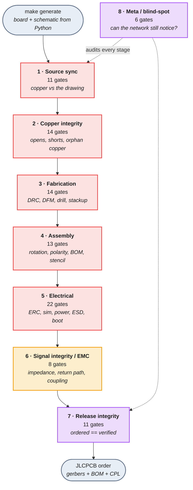
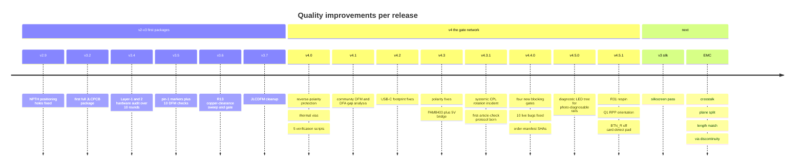

# Production Test Map

**99 automated gates** stand between `make generate` and a JLCPCB order.
This page is the picture of them: what each one prevents, how the EMC surface
is covered, and how the network grew release by release.

:::info Source of truth
The roster below is `VERIFY_ALL_SCRIPTS` in the `Makefile` (95 gates) plus the
4 EMC gates being registered now. Severity is not editorial — it is what
`scripts/issue_dispatch.py` assigns each gate through its routing law.
:::

---

## A. Production test coverage map

### Severity ranking

<strong style={{fontSize: "0.85rem"}}>blind-spot</strong> the gate network itself is broken, so no other verdict is trustworthy

<strong style={{fontSize: "0.85rem"}}>dead-board</strong> the board does not work, or is assembled wrong

<strong style={{fontSize: "0.85rem"}}>degraded</strong> it works, but out of spec — margin, heat, EMC

<strong style={{fontSize: "0.85rem"}}>cosmetic</strong> documentation and rendering only

### Pipeline

Stage colour = the severity most of its gates carry. Individual gates vary — the roster below is per-gate.

### The 99 gates

<strong style={{fontSize: "1.02rem"}}>Source sync</strong>
<code style={{fontSize: "0.78rem"}}>11 gates</code>
Does the copper still match the drawing?

test_enclosure_sync
verify_enclosure_sync
verify_firmware_retrogo_sync
verify_netlist_diff
verify_netlist_vs_kicad
verify_schematic_crossings
verify_schematic_label_attach
verify_schematic_overlaps
verify_schematic_pcb
verify_schematic_pcb_sync
verify_schematic_pin_connectivity

<strong style={{fontSize: "1.02rem"}}>Copper integrity</strong>
<code style={{fontSize: "0.78rem"}}>14 gates</code>
Is every net one piece of copper, and nothing else touching it?

short_circuit_analysis
test_collision_pad_nets
test_collision_via_metric
test_pcb_connectivity
test_power_net_integrity
verify_component_connectivity
verify_dangling_copper
verify_isolation
verify_net_connectivity
verify_power_net_integrity
verify_trace_crossings
verify_trace_through_pad
verify_zone_connectivity
verify_zone_fill_sanity

<strong style={{fontSize: "1.02rem"}}>Fabrication</strong>
<code style={{fontSize: "0.78rem"}}>14 gates</code>
Will the fab build it as drawn, without silently correcting it?

analyze_pad_distances
drc_check
validate_jlcpcb
verify_copper_balance
verify_copper_clearance
verify_dfm_v2
verify_drill_standards
verify_gerber_integrity
verify_jlcpcb_capabilities
verify_jlcpcb_via_rules
verify_net_class_widths
verify_stackup
verify_thermal_relief
verify_via_in_pad

<strong style={{fontSize: "1.02rem"}}>Assembly</strong>
<code style={{fontSize: "0.78rem"}}>13 gates</code>
Will the pick-and-place put the right part down the right way round?

test_cpl_rotation_law
test_test_points
verify_bom_cpl_pcb
verify_bom_values
verify_cpl_rotation_law
verify_datasheet
verify_datasheet_nets
verify_dfa
verify_easyeda_footprint
verify_polarity
verify_rpp_polarity
verify_stencil_aperture
verify_test_points

<strong style={{fontSize: "1.02rem"}}>Electrical</strong>
<code style={{fontSize: "0.78rem"}}>22 gates</code>
Once powered, does the circuit do what it was specified to do?

erc_check
simulate_circuit
spice_power_check
test_erc_severity
test_esd_protection
test_power_via_ampacity
test_strapping_en_rc
verify_battery_protection
verify_decoupling_adequacy
verify_decoupling_paths
verify_design_intent
verify_erc
verify_esd_protection
verify_ground_loops
verify_power_paths
verify_power_resonance
verify_power_sequence
verify_power_via_ampacity
verify_sd_interface
verify_signal_chain_complete
verify_strapping_pins
verify_thermal_budget

<strong style={{fontSize: "1.02rem"}}>Signal integrity / EMC</strong>
<code style={{fontSize: "0.78rem"}}>8 gates</code>
Does it still work at speed, and stay quiet while doing it?

verify_antenna_keepout
verify_crosstalk *
verify_length_match *
verify_reference_plane *
verify_usb_impedance
verify_usb_impedance_stackup
verify_usb_return_path
verify_via_discontinuity *

<strong style={{fontSize: "1.02rem"}}>Release integrity</strong>
<code style={{fontSize: "0.78rem"}}>11 gates</code>
Is the thing being ordered the thing that was verified?

test_claims_ledger
test_gerber_etest
test_order_manifest
test_verify_memory
verify_bringup_fresh
verify_claims_ledger
verify_context_budget
verify_gerber_etest
verify_memory
verify_net_explorer_fresh
verify_order_manifest

<strong style={{fontSize: "1.02rem"}}>Meta / blind-spot</strong>
<code style={{fontSize: "0.78rem"}}>6 gates</code>
Can the gate network still be trusted to notice?

test_gate_coverage
test_issue_dispatch
test_vbench
test_vbench_display
test_vbench_dynamics
test_vbench_sdcard

<code>*</code> = new EMC gate. Hover a chip for its severity.

---

## B. EMC coverage grid

The 16 classic EMC layout mistakes, and which gate catches each one.

01PARTIAL

Broken Return Path

verify_usb_return_path

advisory outside USB

02PARTIAL

Long Loop Area

verify_dfm_v2 · verify_decoupling_paths

buck hot-loop + cap ratio

03COVERED

Split Reference Plane

verify_stackup · verify_power_net_integrity

one piece of copper per plane

04COVERED

Decoupling Placement

verify_decoupling_paths · verify_decoupling_adequacy

path length and capacitance

05NEW GATE

Signal Crossing Gaps

verify_reference_plane

traces over plane voids

06PARTIAL

Poor Ground Return

verify_ground_loops · verify_zone_connectivity

loops found, area not scored

07COVERED

Trace Spacing

verify_copper_clearance

polygon-accurate gaps

08PARTIAL

RF Shielding

verify_antenna_keepout

no shield can on board by design

09PARTIAL

Return Via Placement

verify_usb_return_path

USB pair only

10PARTIAL

High-Speed Routing

verify_usb_impedance

limits derived from bit rate

11NEW GATE

Crosstalk 3W

verify_crosstalk

parallel-run coupling

12COVERED

Uncontrolled Impedance

verify_usb_impedance_stackup

JLC04161H-7628 stackup

13NEW GATE

Trace Length Mismatch

verify_length_match

skew against edge rate

14NEW GATE

Via Discontinuity

verify_via_discontinuity

stub and count heuristics

15PARTIAL

Termination

verify_usb_impedance

USB series R proven in-path

16PARTIAL

Shield Stitching

verify_zone_connectivity

no lambda/20 spacing rule

<strong>4 covered · 4 new gates · 8 partial.</strong> "Partial" means a gate fires on
the failure mode but over a narrower scope than the general rule — usually the USB
pair rather than every net.

---

## C. Version improvements

---

## Where to go next

- [Pre-Production Verification](/docs/manufacturing/verification) — what each gate
  actually asserts, and the JLCPCB threshold tables behind them
- [PCBA Manufacturing & Ordering](/docs/manufacturing) — the order package itself
- `make open-issues` — which of these 99 gates is red right now
- `make dispatch` — turn every red gate into an owned work order
